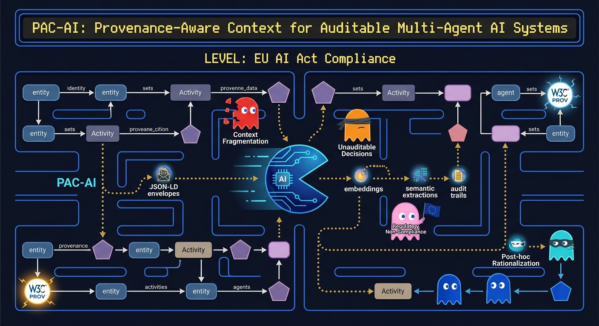

<p align="center">
  
</p>

A provenance-aware context protocol for multi-agent AI systems, designed for **EU AI Act compliance**. jhcontext defines how AI agents exchange, audit, and prove the integrity of context — from specification to production deployment.

---

## How It Fits Together

```
                    jhcontext-protocol
                   (JSON-LD specification)
                           │
                           ▼
                      jhcontext-sdk
                 (Python SDK on PyPI)
                      ╱          ╲
                     ▼            ▼
          jhcontext-usecases    jhcontext-crewai
          (in-memory POC)       (AWS production)
          ~25 ms, no infra      Lambda + DynamoDB + S3
```

## Repositories

| Repository | What it is | Start here |
|:-----------|:-----------|:-----------|
| [**jhcontext-protocol**](https://github.com/jhcontext/jhcontext-protocol) | JSON-LD specification (v0.5). Defines the envelope structure, UserML-correct SituationalStatement shape (Heckmann five-tuple mainpart), forwarding policies, and W3C PROV provenance mappings. | `jhcontext-core.jsonld` |
| [**jhcontext-sdk**](https://github.com/jhcontext/jhcontext-sdk) | Python SDK. EnvelopeBuilder, ForwardingEnforcer, StepPersister, PROV graph builder, PII tokenization, audit functions, FastAPI server, and MCP server. | `pip install jhcontext` |
| [**jhcontext-usecases**](https://github.com/jhcontext/jhcontext-usecases) | Lightweight proof-of-concept. Healthcare (Art. 14 temporal oversight) and Education (Art. 13 negative proof) scenarios with a 7-benchmark suite. Runs in ~25 ms, no infrastructure needed. | `python -m usecases.run` |
| [**jhcontext-crewai**](https://github.com/jhcontext/jhcontext-crewai) | Production deployment on AWS. CrewAI multi-agent flows for Healthcare, Education, Recommendation, and Finance with Chalice Lambda API, DynamoDB, and S3 storage. | `docs/architecture.md` |

## What the Protocol Does

An **envelope** is a context container that travels between AI agents. It carries:

- **Semantic payload** — a SituationReport of atomic UserML SituationalStatements (Heckmann 2005), each with a five-tuple `mainpart {subject, auxiliary, predicate, range, object}`, optional `situation` + `explanation` boxes, and an `administration.group` classifier (`Observation` / `Interpretation` / `Situation` / `Application`). Directly SPARQL-queryable against the `jh:` vocabulary.
- **Artifacts** tracking every computational product (model outputs, embeddings, tool results)
- **Forwarding policy** with monotonic enforcement — once set to `semantic_forward` (HIGH-risk), raw context is permanently filtered
- **W3C PROV graph** linking entities, activities, and agents across the pipeline
- **Cryptographic proof** via URDNA2015 canonicalization, SHA-256 hashing, and Ed25519 signatures
- **Privacy and compliance** blocks for PII tracking and regulatory metadata

## EU AI Act Compliance

Six auditable operations, each demonstrated end-to-end in the usecases and crewai repos. Every verifier is a thin wrapper over a SPARQL query against the recorded SituationReports:

| Pattern | EU AI Act | What it proves |
|:--------|:----------|:---------------|
| Temporal oversight | Art. 14 | A human reviewed AI output *after* the recommendation, with verifiable timestamps |
| Negative proof | Art. 13 | Protected attributes (identity, disability) were absent from the decision chain |
| Workflow isolation | Art. 13 | Parallel workflows (e.g., grading vs. equity) shared zero PROV entities |
| Integrity verification | General | SHA-256 hash and Ed25519 signature over canonical JSON-LD remain valid |
| Rubric grounding | Art. 12 + Art. 86 | Every LLM feedback sentence binds to a rubric criterion and cites an evidence span in the student text |
| Multimodal binding | Art. 12 | Audio / image / video artifact citations resolve to the exact region in the referenced source |

## Quick Start

```bash
pip install jhcontext
```

```python
from jhcontext import EnvelopeBuilder, RiskLevel, observation, interpretation

# Build a SituationReport — a flat list of atomic UserML SituationalStatements
payload = [
    observation("user:alice", "temperature", 22.3,
                range_="float-degrees-celsius",
                source="sensor:thermostat-01"),
    interpretation("user:alice", "thermalComfort", "comfortable",
                   range_="uncomfortable-neutral-comfortable",
                   confidence=0.92),
]

env = (
    EnvelopeBuilder()
    .set_producer("did:example:agent-1")
    .set_scope("healthcare")
    .set_risk_level(RiskLevel.HIGH)        # auto-sets forwarding_policy=semantic_forward
    .set_human_oversight(True)
    .set_semantic_payload(payload)
    .sign("did:example:agent-1")
    .build()
)
```

## Links

[jhcontext.com](https://jhcontext.com) ・ [YouTube](https://youtube.com/@jhcontext) ・ [Substack](https://substack.com/@jhcontext) ・ [X](https://x.com/jhcontext) ・ [Threads](https://threads.net/@jhcontext)

---

*jhcontext is a research project — reference implementation of PAC-AI, a provenance-aware context protocol.*
